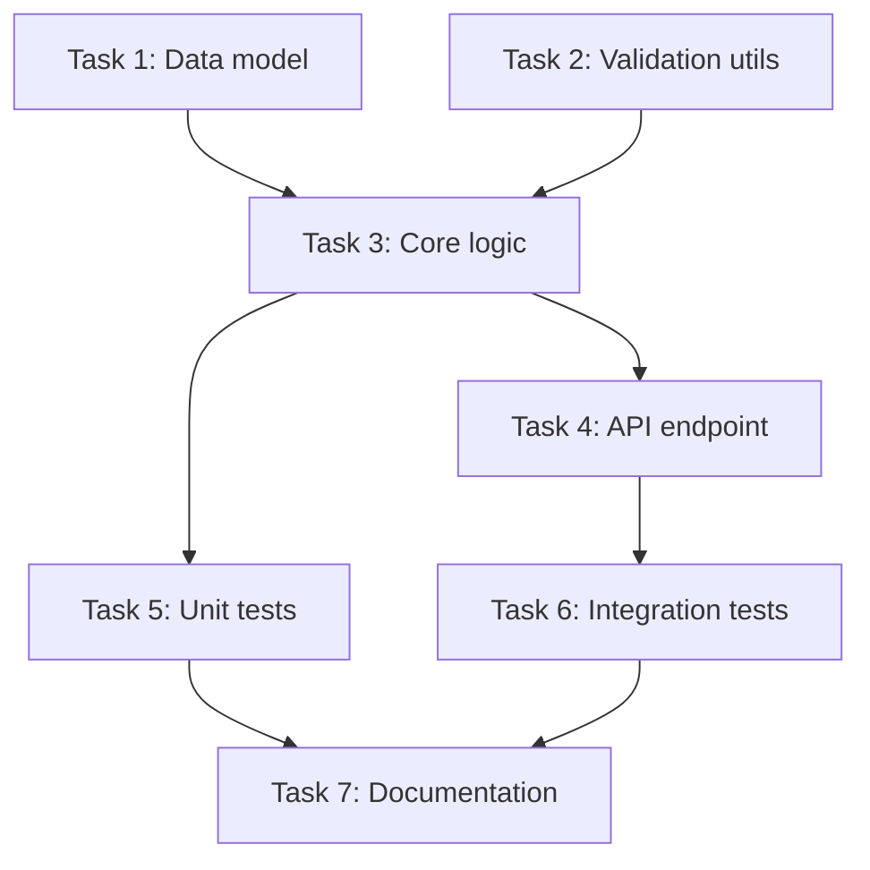

# Issue Decompose

Break down a complex issue, feature request, or bug report into a structured set of actionable subtasks. Each subtask is independently scoped, estimated, prioritized, and linked to its dependencies. The result is a work breakdown suitable for sprint planning, task tracking, or systematic implementation.

## Prerequisites

- A defined issue, feature request, or bug report with enough context to understand the scope.
- The eMCP filesystem and ast_search servers available for codebase analysis when decomposing implementation tasks.
- Access to the project's issue tracker or task management system for subtask creation.

## Overview

Large issues are difficult to implement in a single pass. This skill applies a systematic decomposition process:

1. Understand the full scope of the issue
2. Explore the relevant codebase to identify affected areas
3. Break the work into atomic, testable subtasks
4. Establish dependency ordering
5. Estimate effort and assign priorities
6. Produce a structured plan

The output is a prioritized, dependency-aware task list that can be fed into a task tracker, used as a checklist, or executed sequentially.

## Step 1: Understand the Issue

Read and parse the issue description provided by the user. The input may come from:

- A pasted issue body (text in the conversation)
- A reference to a GitHub/GitLab issue (use available tools to fetch it)
- A verbal description from the user
- A document or specification file (use `fs_read` to load it)

Extract the following from the issue:

- **Title**: one-line summary of what needs to be done
- **Description**: full explanation of the feature or bug
- **Acceptance criteria**: specific conditions that must be met for the issue to be considered complete. If not provided, derive them from the description.
- **Constraints**: performance requirements, backwards compatibility, platform support, etc.
- **Context**: related issues, prior discussions, or relevant documentation

If the issue description is vague or incomplete, ask the user clarifying questions before proceeding. Good decomposition requires a clear understanding of the goal.

## Step 2: Begin Reasoning

Use `think_start` to begin a structured reasoning chain. Frame the problem as:

"Decompose [issue title] into implementable subtasks. The goal is [acceptance criteria]. The constraints are [constraints]."

Within the reasoning chain, work through the following questions:

- What are the major components of this change?
- Which parts of the codebase will be affected?
- Are there any prerequisites that must be in place first?
- What are the risks or unknowns?
- Can any parts be done in parallel?
- What is the minimal viable implementation versus the full implementation?

Document the reasoning process. This provides transparency into the decomposition logic and helps the user understand the plan.

## Step 3: Explore the Codebase

Use filesystem and code intelligence tools to understand the affected areas:

1. **File discovery**: Use `fs_list` and `fs_search` to find files related to the issue keywords
2. **Code structure**: Use `lsp_references`, `lsp_definitions`, or `lsp_symbols` to trace the call graph and type hierarchy relevant to the change
3. **Test structure**: Identify existing tests that cover the affected code
4. **Configuration**: Check for feature flags, environment variables, or configuration that might be involved
5. **Dependencies**: Identify internal module dependencies that might create coupling

For each affected area, note:
- The file path
- What needs to change (add, modify, remove)
- How complex the change is (simple edit, new module, architectural change)
- What tests cover this area

Build a mental map of the change surface. The decomposition should align with the code's actual structure, not an idealized view.

## Step 4: Decompose into Subtasks

Break the issue into subtasks following these principles:

### Atomicity
Each subtask should represent a single logical change that can be implemented, tested, and reviewed independently. A subtask should not require partial completion -- it is either done or not done.

### Testability
Each subtask must have a clear way to verify completion. This could be:
- A new test that passes
- An existing test that continues to pass after the change
- A manual verification step with specific expected behavior

### Appropriate Granularity
Subtasks should be sized so that each takes between 30 minutes and 4 hours of focused work. Apply these guidelines:

- **Too large**: "Implement user authentication" -- this has many sub-components
- **Too small**: "Add import statement for auth module" -- this is a single line change, not a task
- **Right size**: "Add password hashing utility using bcrypt with configurable rounds" -- clear scope, testable, meaningful unit of work

### Standard Subtask Structure

For each subtask, define:

```
Task: <concise title>
Description: <1-3 sentences explaining what to do>
Files: <list of files to create or modify>
Tests: <what test to write or update>
Acceptance: <specific completion criteria>
Effort: <small | medium | large>
Priority: <P0 | P1 | P2>
Dependencies: <list of task IDs this depends on>
```

### Common Decomposition Patterns

**Feature implementation** typically decomposes into:
1. Data model / type definitions
2. Core logic / business rules
3. Storage / persistence layer
4. API endpoint or CLI command
5. Input validation
6. Error handling
7. Tests for each layer
8. Documentation updates

**Bug fix** typically decomposes into:
1. Write a failing test that reproduces the bug
2. Identify root cause
3. Implement the fix
4. Verify the fix resolves the failing test
5. Add regression tests for edge cases
6. Update documentation if the bug revealed a misunderstanding

**Refactoring** typically decomposes into:
1. Add characterization tests if missing
2. Extract / reorganize the target code
3. Update all callers and references
4. Remove old code
5. Verify all tests pass
6. Update documentation

## Step 5: Identify Dependencies

Map the dependency graph between subtasks. A dependency exists when:

- Task B requires code or infrastructure created by Task A
- Task B modifies the same file as Task A and would cause merge conflicts
- Task B tests behavior introduced by Task A
- Task B extends an API surface created by Task A

Represent dependencies as a directed acyclic graph (DAG). Validate that there are no circular dependencies. If a cycle is found, merge the circular tasks into a single task or restructure the decomposition.

Identify the critical path: the longest chain of dependent tasks. This determines the minimum time to complete the full issue.

Identify parallelizable groups: tasks with no dependencies between them that can be worked on simultaneously.

## Step 6: Estimate Effort

Assign an effort estimate to each subtask using a three-point scale:

| Effort   | Time Range   | Characteristics |
|----------|-------------|-----------------|
| **Small**  | < 1 hour    | Single file change, clear implementation path, minimal testing needed |
| **Medium** | 1-4 hours   | Multiple files, some design decisions, moderate testing |
| **Large**  | 4-8 hours   | Significant new code, complex logic, extensive testing, possible research needed |

If a subtask estimates larger than "Large" (more than 8 hours), it should be further decomposed into smaller subtasks.

When estimating, consider:
- Familiarity with the codebase area (new areas take longer)
- Complexity of the logic (algorithms, concurrency, error handling)
- Testing burden (how many test cases are needed)
- Integration risk (how many other components are affected)

Total the effort estimates to provide an overall effort range for the full issue.

## Step 7: Assign Priorities

Assign priorities based on dependency ordering and business value:

| Priority | Meaning | Criteria |
|----------|---------|----------|
| **P0**   | Blocking | Other tasks depend on this. Must be done first. On the critical path. |
| **P1**   | Important | Delivers significant value. Should be done in the current iteration. |
| **P2**   | Nice to have | Improves quality or developer experience. Can be deferred if time is short. |

Rules for priority assignment:
- Tasks with no dependencies that are on the critical path are P0
- Tasks that other tasks depend on are P0
- Tasks that deliver user-facing value are P1
- Tests and documentation that are not blocking are P1
- Optimizations, refactoring of non-critical paths, and polish are P2

## Step 8: Create Tasks in Task Server

If the eMCP task server is available, create each subtask using `task_create`:

- Set the task title to the subtask title
- Set the description to include the subtask description, files, and acceptance criteria
- Set dependencies by referencing the IDs of prerequisite tasks
- Set priority and effort as labels or metadata

If the task server is not available, format the tasks as a structured list in the conversation (see Step 10).

After creating all tasks, use `task_tree` to display the hierarchical view of the decomposed issue.

## Step 9: Visualize the Dependency Graph

Generate a visual representation of the task dependency graph. Use `diagram_render` with Mermaid syntax:



Use color coding or styling to indicate priority:
- P0 tasks: bold borders
- P1 tasks: normal borders
- P2 tasks: dashed borders

If the diagram tool is not available, represent the dependency graph as an indented text tree:

```
T1: Data model (P0, Small)
  T3: Core logic (P0, Medium) [depends on T1, T2]
    T4: API endpoint (P1, Medium) [depends on T3]
      T6: Integration tests (P1, Medium) [depends on T4]
    T5: Unit tests (P1, Small) [depends on T3]
T2: Validation utils (P0, Small)
T7: Documentation (P2, Small) [depends on T5, T6]
```

## Step 10: Format the Work Breakdown

Present the final decomposition in a structured format:

```markdown
# Work Breakdown: <Issue Title>

## Summary
<1-2 sentence summary of the decomposition>

**Total subtasks**: <N>
**Estimated effort**: <total range, e.g., "8-16 hours">
**Critical path**: <T1 -> T3 -> T4 -> T6 -> T7>
**Parallelizable groups**: <[T1, T2], [T4, T5]>

## Subtasks

### T1: <Title> [P0, Small]
**Description**: <what to do>
**Files**: <file list>
**Tests**: <test plan>
**Acceptance**: <completion criteria>
**Dependencies**: none

### T2: <Title> [P0, Small]
**Description**: <what to do>
**Files**: <file list>
**Tests**: <test plan>
**Acceptance**: <completion criteria>
**Dependencies**: none

### T3: <Title> [P0, Medium]
**Description**: <what to do>
**Files**: <file list>
**Tests**: <test plan>
**Acceptance**: <completion criteria>
**Dependencies**: T1, T2

...

## Suggested Order of Execution

1. T1 and T2 (in parallel)
2. T3
3. T4 and T5 (in parallel)
4. T6
5. T7
```

## Step 11: Conclude Reasoning

Use `think_end` to close the reasoning chain. Summarize:

- Total number of subtasks produced
- Overall effort estimate
- Key risks or unknowns identified
- Recommendations for implementation approach (e.g., "start with T1 and T2 in parallel to unblock the critical path")

Present the work breakdown to the user and ask if they want to:
- Adjust any task's scope, priority, or effort
- Merge or split specific tasks
- Add additional tasks that were missed
- Begin implementation starting from the first task

## Guidance on Good Decomposition

### Signs of a Good Decomposition
- Each task has a clear, verifiable outcome
- Tasks are ordered so that each one builds on completed work
- The total effort of subtasks is roughly equal to the estimated effort of the original issue (with 10-20% overhead for integration)
- No single task dominates the effort (indicates it needs further decomposition)
- Parallel execution paths exist (indicates the work has been properly untangled)

### Signs of a Bad Decomposition
- Tasks are vaguely described ("figure out the authentication flow")
- Circular dependencies exist
- Tasks cannot be tested independently
- More than 50% of tasks are labeled P0 (indicates poor prioritization)
- The decomposition has more than 20 subtasks for a single issue (consider grouping into milestones)
- Tasks are so small they create administrative overhead (e.g., "add import statement")

### When to Stop Decomposing
- Each subtask takes between 30 minutes and 4 hours
- Each subtask modifies a coherent set of files (ideally 1-5 files)
- The acceptance criteria for each subtask can be checked with a simple test or inspection
- A developer unfamiliar with the code could pick up any subtask and understand what to do

## Error Handling

- If the issue is too vague to decompose, ask the user for clarification rather than guessing
- If the codebase exploration reveals that the issue is fundamentally different from what was described, report the findings and propose an updated scope
- If dependencies create unavoidable complexity, suggest a phased approach (Phase 1: minimum viable, Phase 2: full implementation)
- If the estimated effort exceeds what the user expected, present the breakdown transparently and discuss which subtasks could be deferred

## Edge Cases

- **Circular dependencies between subtasks**: Two subtasks may each require the other to be completed first. Break the cycle by identifying a minimal stub or interface that unblocks both.
- **Unclear acceptance criteria on the parent issue**: When the parent issue is vague, decomposition produces subtasks that are equally vague. Push for explicit acceptance criteria before decomposing.
- **Cross-team subtasks**: Some subtasks may require work from teams outside the current team's scope. Label these as external dependencies and include coordination steps in the plan.
- **Effort estimates spanning orders of magnitude**: A subtask estimated at "1-40 hours" is not decomposed enough. Require that no subtask spans more than 3x uncertainty (e.g., 2-6 hours, not 1-40).
- **Subtasks that are actually discovery tasks**: Some "implement X" subtasks require research first. Split these into a timeboxed spike followed by the implementation subtask.

## Related Skills

- **e-carto** (eskill-intelligence): Run e-carto before this skill to understand the codebase areas affected by the issue.
- **e-debt** (eskill-intelligence): Follow up with e-debt after this skill to log any technical debt discovered during issue analysis.
