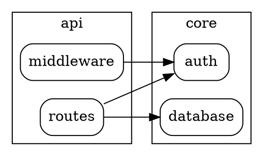

# Diagram from Code

This skill analyzes a codebase to produce architecture, dependency, and relationship
diagrams. It uses filesystem traversal, AST analysis, and LSP queries to extract structural
information, then generates diagrams in Mermaid or Graphviz DOT syntax and renders them
via the eMCP diagram server.

## Prerequisites

The following eMCP tools are required:

- `fs_list` -- list directory contents to discover project structure
- `fs_list` -- display a directory tree for high-level overview
- `ast_search` -- search for AST patterns (imports, class definitions, function calls)
- `lsp_symbols` -- extract symbols (classes, functions, variables) from source files
- `lsp_references` -- find all references to a given symbol
- `diagram_formats` -- list available rendering engines and output formats
- `diagram_render` -- render diagram source code to an image (returns inline)
- `diagram_render_file` -- render diagram source code and write to a file (SVG or PNG)
- `fs_write` -- write diagram source files to disk

## Procedure

### Step 1: Determine Diagram Type

Ask the user or infer from context which type of diagram to generate:

1. **Module dependency diagram**: Shows how modules/packages import from each other.
   Best for understanding the high-level structure of a project.
2. **Class hierarchy diagram**: Shows classes, their methods and properties, and
   inheritance relationships. Best for object-oriented codebases.
3. **Call graph**: Shows which functions call which other functions, starting from a
   specified entry point. Best for understanding execution flow.
4. **Component diagram**: Shows high-level system components and their interactions.
   Best for microservices, plugin architectures, or layered systems.

If the user does not specify, default to a module dependency diagram as it provides the
most broadly useful overview with the least configuration.

### Step 2: Scan Project Structure

Use filesystem tools to understand the project layout:

1. Call `fs_list` on the project root to get an overview. Limit depth to 3 or 4
   levels to avoid overwhelming output.
2. Identify the source directories (e.g., `src/`, `lib/`, `app/`, `packages/`).
3. Identify the language and framework:
   - `package.json` -- Node.js / JavaScript / TypeScript
   - `requirements.txt` or `pyproject.toml` -- Python
   - `Cargo.toml` -- Rust
   - `go.mod` -- Go
   - `pom.xml` or `build.gradle` -- Java
   - `*.csproj` or `*.sln` -- C# / .NET
4. Note configuration files, test directories, and build artifacts so they can be excluded
   from the diagram.
5. Call `fs_list` on key directories to enumerate source files.

Build a mental model of the project organization: what are the top-level modules, where
are the entry points, and what naming conventions are used.

### Step 3: Extract Dependencies (Module Dependency Diagram)

For dependency diagrams, trace import and require statements:

1. Use `ast_search` to find all import statements in the project. Patterns vary by
   language:
   - JavaScript/TypeScript: `import ... from '...'` and `require('...')`
   - Python: `import ...` and `from ... import ...`
   - Go: `import "..."`
   - Rust: `use ...;`
   - Java/C#: `import ...;` / `using ...;`
2. For each import, record the source module and the target module.
3. Distinguish between internal imports (within the project) and external imports
   (third-party packages). By default, include only internal imports in the diagram.
   External dependencies can be included as a separate cluster if the user requests it.
4. Build an adjacency list: `{ source_module: [target_module_1, target_module_2, ...] }`.
5. Detect circular dependencies and flag them. These will be highlighted in the diagram.
6. Group modules by directory or package for readability.

### Step 4: Extract Class Information (Class Hierarchy Diagram)

For class diagrams, use LSP to extract type information:

1. Call `lsp_symbols` on each source file to extract class definitions, including:
   - Class name
   - Methods (name, parameters, return type, visibility)
   - Properties/fields (name, type, visibility)
   - Parent class (inheritance)
   - Implemented interfaces
2. Build a class registry mapping each class to its members and relationships.
3. Identify inheritance chains: which classes extend which.
4. Identify interface implementations: which classes implement which interfaces.
5. Identify composition relationships: classes that hold references to other classes
   as member variables.
6. Limit the diagram scope to avoid clutter:
   - If the user specifies a package or directory, include only classes from that scope.
   - If no scope is specified, include classes from the top two directory levels.
   - Always exclude test classes unless the user requests them.

### Step 5: Extract Call Graph (Call Graph Diagram)

For call graphs, trace function invocations from an entry point:

1. Ask the user for the entry point function or file. If not specified, look for common
   entry points: `main`, `index`, `app`, `server`, `handler`.
2. Use `lsp_symbols` to find the entry point function definition.
3. Use `lsp_references` to find all functions called by the entry point.
4. Recursively trace calls to a configurable depth (default: 3 levels). Deeper call
   graphs become unwieldy.
5. Record each call relationship: `caller -> callee`.
6. Detect recursive calls and mark them in the diagram.
7. Group functions by their containing module or class for readability.
8. Exclude calls to standard library functions and trivial utilities unless the user
   specifically requests them.

### Step 6: Generate Diagram Source Code

Based on the extracted information, generate diagram source code.

**Mermaid syntax** (default, better for rendering in markdown and web contexts):

Module dependency diagram:
```
graph LR
    subgraph core
        A[auth]
        B[database]
    end
    subgraph api
        C[routes]
        D[middleware]
    end
    C --> A
    C --> B
    D --> A
```

Class hierarchy diagram:
```
classDiagram
    class Animal {
        +String name
        +int age
        +makeSound() void
    }
    class Dog {
        +fetch() void
    }
    Animal <|-- Dog
```

Call graph:
```
graph TD
    main --> initialize
    main --> startServer
    startServer --> loadConfig
    startServer --> bindRoutes
    bindRoutes --> registerMiddleware
```

**Graphviz DOT syntax** (better for complex graphs and fine-grained layout control):



Before choosing the format, call `diagram_formats` to check which rendering engines and
output formats are available in the current environment. This prevents failures from
attempting to render with an engine that is not installed. If the user's preferred format
is unavailable, suggest an available alternative.

Choose the format based on user preference and engine availability. If none is specified,
use Mermaid for simple diagrams (under 30 nodes) and Graphviz for complex ones (30+ nodes),
provided the corresponding engine is available.

### Step 7: Render the Diagram

Render the generated diagram source code to an image:

1. For quick preview, use `diagram_render` which returns the image inline for immediate
   viewing.
2. For persistent output, use `diagram_render_file` to write the rendered image to disk.
3. Default output format is SVG, which scales cleanly and can be embedded in documentation.
   Use PNG when the user needs a raster format (e.g., for embedding in presentations or
   uploading to platforms that do not support SVG).
4. Also save the diagram source code (`.mmd` for Mermaid, `.dot` for Graphviz) alongside
   the rendered image so the user can edit and re-render later.

If rendering fails, check the diagram source for syntax errors. Common issues include:

- Special characters in node names (wrap in quotes or brackets)
- Missing semicolons in Graphviz DOT
- Unsupported Mermaid features for the installed renderer version

### Step 8: Output and Refinement

Present the rendered diagram to the user along with:

1. A summary of what was included: number of nodes, edges, clusters/subgraphs.
2. Any notable findings: circular dependencies, orphan modules (no imports or exports),
   deeply nested call chains.
3. The diagram source code so the user can make manual adjustments.

Offer refinement options:

- Filter by directory or namespace to zoom into a specific area
- Adjust depth for call graphs
- Toggle external dependencies on or off
- Change layout direction (left-to-right vs top-to-bottom)
- Highlight specific paths or nodes

## Diagram Templates

### Minimal Module Dependency (Mermaid)

```
graph LR
    A[module-a] --> B[module-b]
    A --> C[module-c]
    B --> D[shared-utils]
    C --> D
```

### Layered Architecture (Mermaid)

```
graph TB
    subgraph Presentation
        UI[UI Components]
        API[API Routes]
    end
    subgraph Business
        SVC[Services]
        VAL[Validators]
    end
    subgraph Data
        REPO[Repositories]
        DB[Database]
    end
    UI --> SVC
    API --> SVC
    SVC --> VAL
    SVC --> REPO
    REPO --> DB
```

### Class Diagram with Relationships (Mermaid)

```
classDiagram
    class Repository {
        <<interface>>
        +findById(id) Entity
        +save(entity) void
        +delete(id) void
    }
    class UserRepository {
        -db: Database
        +findById(id) User
        +save(user) void
        +delete(id) void
        +findByEmail(email) User
    }
    Repository <|.. UserRepository
```

## Limitations

- Dynamically resolved imports (e.g., `importlib.import_module()` in Python, `require()`
  with variable arguments in JavaScript) cannot be statically analyzed and will be missing
  from the diagram.
- Reflection-based method calls will not appear in call graphs.
- Very large codebases (1000+ source files) may produce diagrams that are too dense to be
  useful. In such cases, focus on a specific subsystem or use higher-level grouping.
- Generated diagrams represent a static snapshot. They do not capture runtime behavior,
  async flows, or event-driven interactions unless those patterns are explicitly modeled.

## Edge Cases

- **Circular dependencies creating unreadable layouts**: Cycles in dependency graphs cause layout engines to produce tangled diagrams. Detect cycles, report them textually, and break them visually with dashed edges or a separate "Cycles" section.
- **Diagrams with 100+ nodes**: Large diagrams become unreadable at full scale. Automatically group nodes into clusters by directory or namespace and offer drill-down into specific clusters.
- **Mermaid renderer version incompatibilities**: Some Mermaid syntax (e.g., advanced subgraph nesting) is not supported by older renderers. Check the rendering environment's capabilities before using advanced features.
- **No rendering tool available**: When neither Mermaid nor Graphviz renderers are installed, output the diagram source code only and provide instructions for rendering externally (e.g., mermaid.live, online Graphviz).
- **Mixed diagram types in one request**: The user may want both a module dependency diagram and a class diagram. Generate each as a separate diagram file rather than combining unrelated views into one.

## Related Skills

- **e-carto** (eskill-intelligence): Run e-carto before this skill to map the codebase structure that diagrams will visualize.
- **e-surface** (eskill-coding): Run e-surface before this skill to identify the API endpoints and data flows to include in diagrams.
